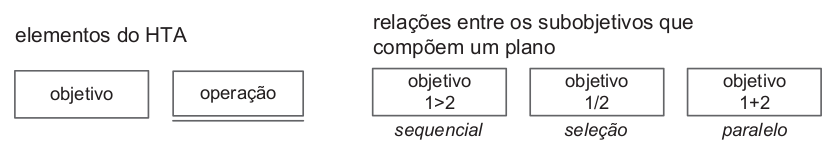
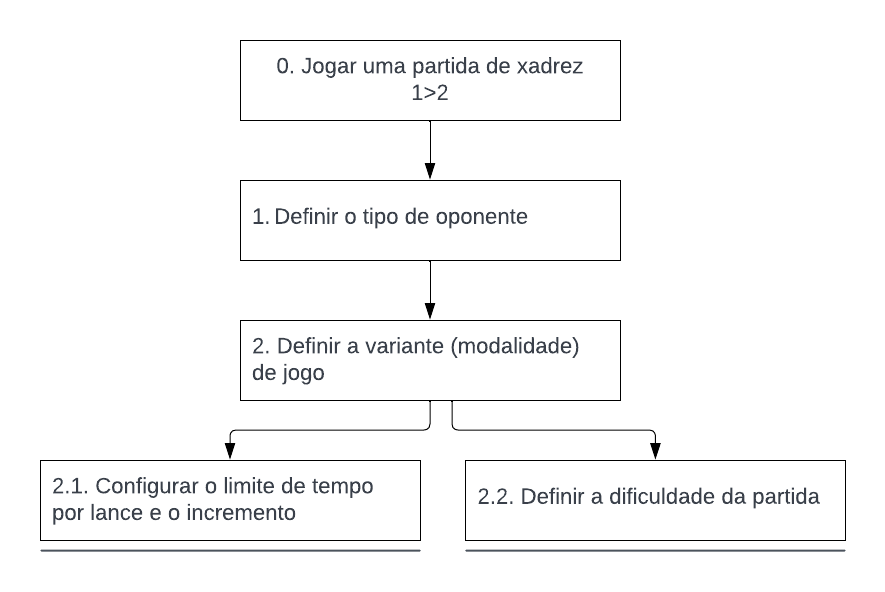

# Análise de Tarefas

## Introdução

A análise de tarefas visa fornecer um maior entendimento sobre as tarefas executadas pelos usuários em um sistema, a partir dos objetivos que os usuários almejam alcançar. Esse processo consiste em, além de listar as ações, compreender como o sistema de trabalho e o domínio da aplicação afetam o funcionamento um do outro.

Essa atividade pode ser realizada durante qualquer uma das três etapas principais do [processo de design](./../planejamento/processo_de_design.md): análise, síntese e avaliação. O documento em questão retrata a análise de tarefas na etapa de avaliação, haja vista que o sistema avaliado já foi implementado, e esse tipo de análise apresenta-se de forma concreta, descrevendo os comportamentos de forma detalhada.

A análise parte de um conjunto de objetivos, em termos psicológicos, das pessoas. Para cada objetivo elabora-se uma lista das ações realizadas, por meio do sistema, para alcançar esse objetivo. De acordo com os estudos de Diaper, a análise de tarefas é capaz de fornecer apenas uma simulação das verdadeiras tarefas de interesse, já que existe uma infinidade de tarefas que podem ser realizadas por diferentes pessoas e apenas uma pequena porção do trabalho pode ser observada. Um insumo importante da análise de tarefas é a observação do **desempenho**, e seus resultados devem ser comparados com os que foram obtidos por meio de entrevistas, questionários e documentação.

Com o intuito de explorar diferentes técnicas, foram avaliadas as tarefas de "jogar uma partida de xadrez" e "aprender a jogar xadrez" por meio de duas metodologias diferentes, a saber: Análise Hierárquica de Tarefas (HTA) e GOMS (Goals, Operators, Methods and Selection Rules). As tarefas selecionadas compõem as duas funcionalidades mais utilizadas pelos usuários do aplicativo, conforme apontam os dados coletados durante a elaboração do [perfil do usuário](perfil_usuario.md).

## Análise Hierárquica de Tarefas (HTA)

Essa metodologia foi desenvolvida na década de 60, com o objetivo de entender habilidades e competências presentes na execução de tarefas complexas e não repetitivas e auxiliar na identificação de problemas de desempenho. Seu enfoque encontra-se em relacionar o que as pessoas fazem, suas motivações e consequências de suas tarefas.

A análise hierárquica de tarefas possui os seguintes elementos:

> **Tarefa**: qualquer parte de um trabalho a ser realizado;
>
> **Objetivo**: um estado final, que pode ser definido por eventos ou valores fisicamente observáveis;
>
> **Subobjetivo**: um objetivo de alto nível é dividido em subobjetivos, por exemplo o objetivo "iniciar uma partida de xadrez" possui, dentre outros, os seguintes subobjetivos: "definir o tipo de oponente, definir a modalidade de jogo e configurar o incremento";
>
> **Plano**: o conjunto de subobjetivos de um objetivo e suas relações consiste em um plano;
>
> **Operação**: circunstâncias de ativação do objetivo (_input_ ou entrada), atividades ou ações (_actions_) para alcançá-lo e condições que indicam seu atingimento (_feedback_)
>

A análise hierárquica de tarefas pode ser representada na forma textual, por meio de uma tabela, por exemplo, ou por um diagrama. No segundo caso, utiliza-se a notação representada na Figura 1.

 Figura 1: Elementos do diagrama (Fonte: [1]).

### Análise da tarefa: jogar uma partida de xadrez

A tarefa "jogar uma partida de xadrez" é a principal tarefa que o usuário realiza no sistema, já que é sua funcionalidade principal. A Tabela 1 e a Figura 2 apresentam a análise hierárquica dessa tarefa em sua forma textual e de diagrama, respectivamente.

| Objetivos/Operações | Problemas e recomendações |
| - | - |
| 0. Jogar uma partida de xadrez  (1 > 2) | **input**: acesso ao menu "iniciar partida" na tela inicial;   **feedback**: tela de jogo, com oponente e informações sobre a partida;   **plano**: definir o tipo de oponente (computador, amigo ou aleatório) e depois configurar a partida;   **recomendação**: permitir que o usuário inicie um jogo a partir da tela inicial. |
| 1. Definir o tipo de oponente | |
| 2. Configurar a partida (1+2)  | **plano**: definir a variante de xadrez, os tempos e incrementos para cada lance e o nível de dificuldade (em caso de partida contra o computador) | |
| 2.1 Definir a variante de xadrez  | |
| 2.2 Definir o tempo e incremento para cada lance | |
| 2.3 Definir o nível de dificuldade   |  |

 Tabela 1: Análise Hierárquica de Tarefas para o objetivo "jogar uma partida de xadrez"  (Fonte: autor, 2022).

 Figura 2: Diagrama da Análise Hierárquica de Tarefas para o objetivo "jogar uma partida de xadrez"   (Fonte: autor, 2022).

## Objetivos, Operadores, Métodos e Regras de Seleção (GOMS)

De acordo com Barbosa et al [1], o conjunto de modelos GOMS (_Goals, Operators, Methods and Selection Rules_ - Objetivos, Operadores, Métodos e Regras de Seleção), visa analisar o desempenho de usuários competentes de sistemas computacionais realizando tarefas dentro de sua competência e sem cometer erros. Compõem a família de modelos GOMS algumas técnicas, dentre as quais a o modelo CMN-GOMS foi selecionado para a análise da tarefa aprender a jogar xadrez. Esse método representa as tarefas por meio de uma linguagem de pseudocódigo, indicando a ordem sequencial dos objetivos. Esse modelo visa prever a sequência dos operadores e o tempo de execução desempenhado em uma tarefa.

### Análise da tarefa: aprender a jogar xadrez

O modelo GOMS foi utilizado para analisar a tarefa "aprender a jogar xadrez", sendo o escopo de avaliação a situação em que um usuário experiente com a plataforma deseja aprender os conceitos iniciais de xadrez.

GOAL 0: aprender a jogar xadrez

GOAL 1: encontrar a seção de estudo da plataforma

OP. 1.1: posicionar o cursor do mouse sobre o menu aprender

OP. 1.2: clicar no menu "básicos do xadrez" 

GOAL 2: selecionar o assunto para estudar 

OP. 2.1: girar a roda do mouse para a modalidade desejada 

OP. 2.2: clicar na opção desejada 

GOAL 3: estudar o assunto escolhido 

OP. 3.1: fazer a leitura do tutorial à direita da página 

OP. 3.2: movimentar as peças no tabuleiro clicando nelas e nas posições de destino 

## Bibliografia

[1] Barbosa, S. D. J.; Silva, B. S. da; Silveira, M. S.; Gasparini, I.; Darin, T.; Barbosa, G. D. J. (2021) Interação Humano-Computador e Experiência do usuário. Autopublicação. ISBN: 978-65-00-19677-1.

## Histórico de Versão

| Versão | Data       | Descrição                          | Autor(es)     |  Revisor(es)  |
| ------ | ---------- | ---------------------------------- | ------------- | ------------- |
| `1.0`  | 27/11/2022 | Criação do documento.              | Nicolas Souza |  Lucas Macedo |
