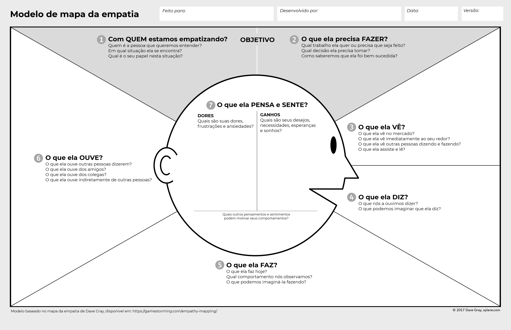

# Mapa de Empatia

## Introdução

O mapa de empatia é uma ferramenta que nos ajuda a conhecer e entender melhor os usuários, suas necessidades, desejos e limitações, através de um diagrama que estabelece tópicos e perguntas sobre áreas de vida de uma persona. O objetivo do mapa de empatia é obter um conhecimento mais profundo sobre uma persona, onde a leva a realizar as ações dentro da aplicação, por exemplo a decisão de uma compra ou uma experiência usando um produto ou serviço.

### Quando aplicar

É ideal aplicar o mapa de empatia depois de ter as personas bem definidas e claras, pois assim irá proporcionar uma analise mais aprofundada dos clientes. Ele pode ser executado numa lousa com post-its, flip-chart, papel sulfite ou no computador. Para isso, é necessário responder aos sequintes questionamentos, também representados na figura 1:

- com quem estamos sendo empáticos?
- o que ela/ele precisa fazer?
- o que ela/ele vê?
- o que ele/ela fala?
- o que ele/ela faz?
- o que ele/ela escuta?
- o que ele/ela pensa e sente? Quais são duas dores e desejos?

 Imagem 1: Mapa de empatia(Fonte: Dave Gray, XPlane).

### Relação com as personas

A partir da criação das personas e os perfis de usuários, o mapa de empatia é um detalhamento mais profundo e detalhado do usuário, que visa entender sentimentos, desejos e necessidades a respeito da aplicação. Diante disso, o mapa de empatia e as personas se relacionam diretamente e são dependentes entre si.

## Desenvolvimento

Para realizar o desenvolvimento do mapa de empatia, utilizaremos como base a persona [Ravi](personas.md) respondendo as questões apresentadas

### 1. O que Ravi pensa e sente?

- "Preciso me dedicar aos meus estudos para ser o melhor no que faço"
- "Prefiro ficar na companhia dos meus conhecidos do que conhecer pessoas novas"

### 2. O que ele ouve?

- Consome muitas aulas gravadas para aperfeiçoar suas ténicas no xadrez e matemática
- Usa principalmente o Telegram para se comunicar e enviar memes para seus colegas

### 3. O que ele faz e fala?

- Participa frequentemente de competições de xadrez e dedica para ficar em primeiro
- Vai aos cinemas para assistir filmes de heróis
- Frequenta locais de jogos de tabuleiro e seus jogos favoritos são aqueles que pode manipular o jogo

### 4. O que ele vê?

- Necessidade constante de se desafiar em suas competições
- Gravações de suas partidas passadas para melhorar suas jogadas

### 5. Quais suas dores?

- Quer provar para outros que consegue superar até seus maiores desafios
- Sente que precisa se dedicar sempre para tudo que faz, já que é fundamental em seu estilo de vida.

### 6. Quais suas necessidades?

- "Preciso estar no topo da classificação de xadrez entre outras pessoas"
- "Preciso me dedicar mais ao meu futuro para não ser estagnado na vida"

## Conclusão

O mapa é uma ferramenta simples, mas que possue uma análise visual prática entre os desenvolvedores e usuários, passando a ter uma comunicação direta com a persona e enteder sua realidade. Mas além de se ter uma boa comunicação com usuários, é preciso se ter um bom relacionamento desde o início.

## Bibliografia

[1] Direcione ainda mais as suas ações de marketing para sua persona utilizando o mapa de empatia. **RockContent**, 2019. Disponível em: <https://rockcontent.com/br/blog/mapa-de-empatia/>. Acessado em: 06 de dez. de 2022.

## Histórico de Versão

| Versão | Data     | Descrição            | Autor(es)    | Revisor(es) |
| ------ | -------- | -------------------- | ------------ | ----------- |
| `1.0`  | 06/12/22 | Criação do documento | Lucas Macedo | ---         |
