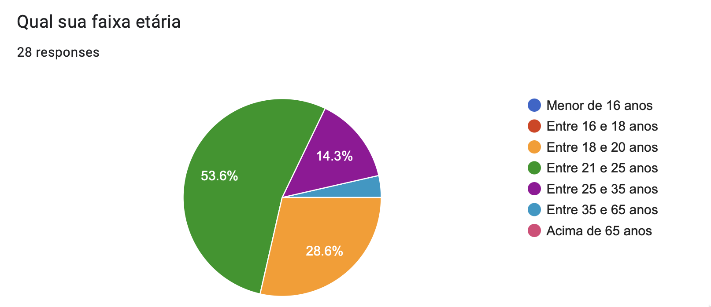
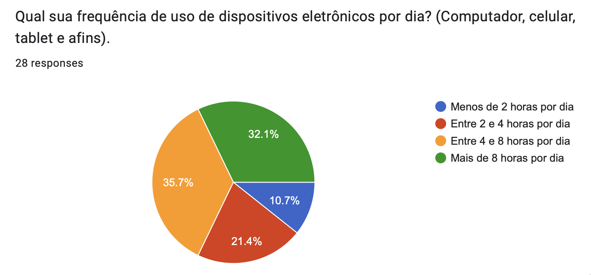
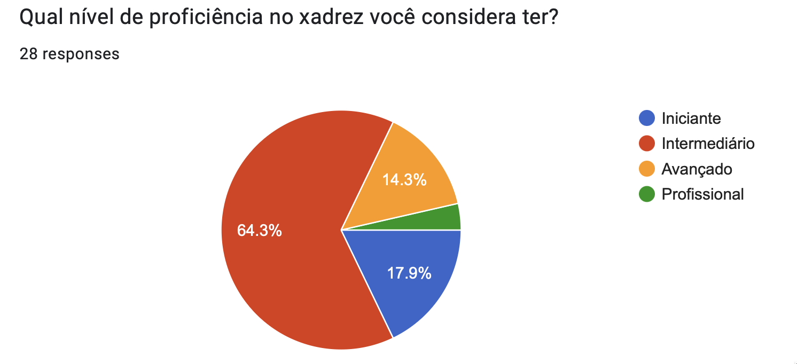
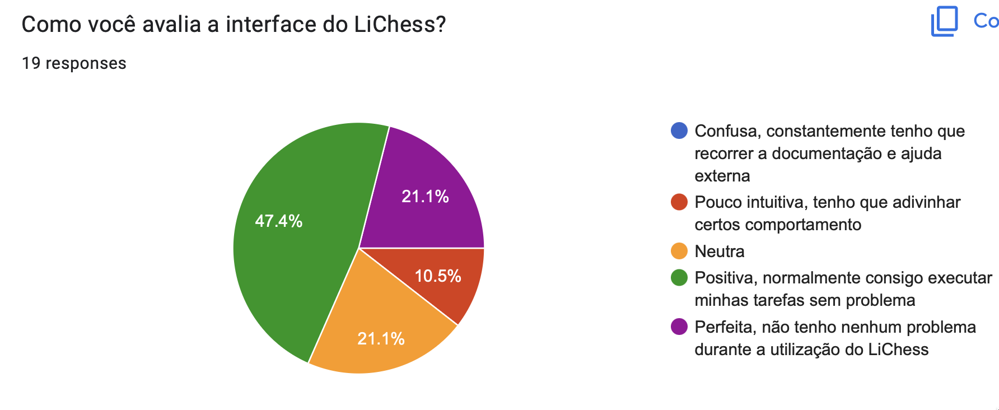
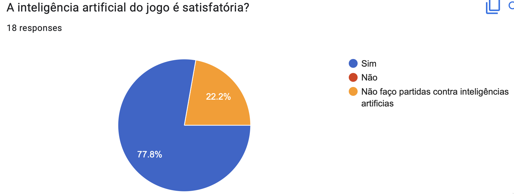
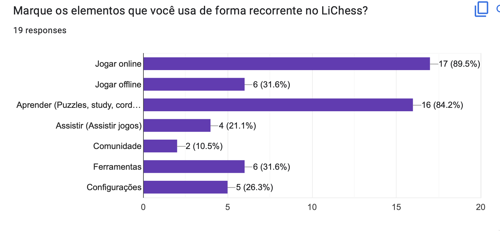

# Perfil de Usuário

## Introdução

A análise do perfil de usuário do sistema visa descobrir e definir quais as características das pessoas que utilizam/utilizarão o sistema que está sendo desenvolvido. Essa etapa é de extrema importância para poder melhorar a experiência de quem acessa o software.

Para obter esses dados foi realizado um questionário.

## Metodologia

### Vantagens

- Técnica relativamente rápida e barata de ser aplicada.
- Obtém de maneira mais fácil informações de um público numeroso.
- Em geral não demanda tanto tempo dos respondentes como em uma entrevista.
- Muito útil quando o público-alvo está disperso geograficamente.
- Quando aplicado a uma amostra representativa das partes interessadas, permite representar as opiniões de toda a população.
- As questões com respostas limitadas são muito efetivas para a geração de dados quantitativos para análise estatística.

### Desvantagens

- Se a taxa de resposta for baixa, o resultado pode não ser estatisticamente significativo.
- Uma falha na elaboração do questionário pode levar a respostas em branco ou incorretas, ou também gerar interpretações distintas da mesma pergunta, o que pode levar a erros nos requisitos.
- O uso de questões com respostas ilimitadas demanda mais esforço de análise das respostas, se o público for numeroso.

## Resultados coletados

A seguir iremos mostrar os resultados coletados para cada questão do formulário. O formulário conta com 52 respostas, antes da coleta os usuários aceitaram o nosso [termo consentimento](https://docs.google.com/document/d/1mpv84VxXb-ld8qBgqgDsLqtA2fs2hG_L8Ta4iR4A4lI/edit?usp=sharing)
A fim de conhecer apenas o público que já utiliza o aplicativo foi estabelecida uma pesquisa de filtragem. Assim das 52 respostas coletadas apenas 28 usam o Lichess seja via site ou aplicativo.
Respostas foram coletadas entre as datas **20/11/2022** e **24/11/2022**.

### Questão 1

 Figura 1: Pergunta 1. (Fonte: autor, 2022).

### Questão 2

 Figura 2: Pergunta 2. (Fonte: autor, 2022).

### Questão 3

Na Tabela 1, estão listadas as resposta diretas do nosso usuário, sem edição e/ou correção ortográfica.

|                                                                                                                   **Descreva um dia agradável para você**                                                                                                                   |
| :-------------------------------------------------------------------------------------------------------------------------------------------------------------------------------------------------------------------------------------------------------------------------: |
|                                                                  Um dia que já fiz todas minhas responsabilidades, sai com meus amigos d tarde e d noite consigo jogar alguma coisa (muitas vezes xadrez).                                                                  |
|                                                                                         Em que tudo da certo e eu consigo fazer as coisas no horário certo e da forma mais maneira                                                                                          |
|           Um dia em que eu possa realizar minhas responsabilidades e ter tempo satisfatório pra lazer e descanso. Mas também pode ser um dia com muitas e diferentes responsabilidades contanto que eu consiga fazer todas e consiga ter um bom desempenho nelas.           |
| Acordar sem sono kkk tomar um café, não atrasar pra pegar o ônibus, ir lendo ou ouvindo música pelo celular até chegar na faculdade, ter aulas de manhã e de tarde de assuntos que gosto, voltar pra casa, terminar exercícios e ficar jogando no computador até ir dormir. |
|                                                                                                                        Com tempo para hobbies e ócio                                                                                                                        |
|                                                                                         Um dia com: sono satisfatório, interação social, exercício físico e realização das tarefas.                                                                                         |
|                                                                                                                Um dia sem trabalho e cobrança da faculdade.                                                                                                                 |
|                                                                                                                           Um dia sem preocupações                                                                                                                           |
|                                                                                      Um dia agradável consiste em eu conseguir realizar minha rotina de estudos com um bom desempenho                                                                                       |
|                                                                                                          Dias onde eu possa fazer as coisas que eu tenha vontade.                                                                                                           |
|                                                                                                    Eu acordo, estudo, como, dou aula, estudo mais um pouco e vou dormir.                                                                                                    |
|                                                                                                                   Depois das 17h quando chego do trabalho                                                                                                                   |
|                                                                              Um dia em que eu consiga cumprir com minhas obrigações com tranquilidade e aproveitar meus hobbies ao fim do dia.                                                                              |
|                                                                                                                        Sair com os amigos para beber                                                                                                                        |
|                                                                                                 Acordar às 10h, amassar meu doguinho num abraço e jogar algo no computador.                                                                                                 |

 Tabela 1: Respostas pergunta 3. (Fonte: autor, 2022).

### Questão 4

Na Tabela Respostas Pergunta 4, estão listadas as resposta diretas do nosso usuário, sem edição e/ou correção ortográfica.

|              Quais jogos de tabuleiro você mais gosta?              |
| :-----------------------------------------------------------------: |
|                               Xadrez                                |
|            Gosto de xadrez, war e interpol. Entre outros            |
|                 Xadrez, Puerto rico, the resistence                 |
|                   Xadrez, perfil, war, monopoly,                    |
| Dungeons&Dragons, Xadrez, Munchkin, Catan/War, e alguns de baralho. |
|                           xadrez e damas                            |
|            Xadrez, Splendor, Puerto Rico, Go e Fanorona             |
|              Xadrez, war, ticket to ride, coupe, dixit              |
|                            Catan, Quest                             |
|                       Xadrez, war, zombicide                        |
|                           Ticket to ride                            |
|                            Xadrez e war                             |
|                            Xadrez, damas                            |

 Tabela 2: Respostas pergunta 4. (Fonte: autor, 2022).

### Questão 5

 Figura 3: Pergunta 5. (Fonte: autor, 2022).

### Questão 6

 Figura 4: Pergunta 6. (Fonte: autor, 2022).

### Questão 7

| Qual a frequência que você joga Lichess? | Votos | Porcentagem |
| :--------------------------------------: | :---: | :---------: |
|         Mais de uma vez por dia          |   1   |    3,6%     |
|              1 vez por dia               |   9   |     32%     |
|             1 vez por semana             |   5   |     18%     |
|             2 vez por semana             |   3   |    10,7%    |
|             3 vez por semana             |   2   |    7,1%     |
|              1 vez por mês               |   2   |    7,1%     |
|           1 vez a cada 2 meses           |   2   |    7,1%     |
|                  Outros                  |   4   |    14,3%    |

 Tabela 3: Respostas pergunta 7. (Fonte: autor, 2022).

### Questão 8

### Questão 9

| Qual seu tempo médio de uso do Lichess antes de ficar cansado? | Votos | Porcentagem |
| :------------------------------------------------------------: | :---: | :---------: |
|                         Até 30 minutos                         |   5   |    26,3%    |
|                     Entre 30 e 60 minutos                      |   4   |   21,05%    |
|                       Entre 1 e 2 horas                        |   4   |   21,05%    |
|                       Entre 2 e 3 horas                        |   2   |   10,55%    |
|                        Mais de 3 horas                         |   4   |   21,05%    |

 Tabela 4: Respostas pergunta 9. (Fonte: autor, 2022).

### Questão 10

 Figura 5: Pergunta 10. (Fonte: autor, 2022).

### Questão 11

 Figura 6: Pergunta 11. (Fonte: autor, 2022).

### Questão 12

 Figura 7: Pergunta 12. (Fonte: autor, 2022).

### Questão 13

|                                                                                                Você tem algum feedback sobre como site Lichess pode dar uma experiência melhor para o usuário?                                                                                                |
| :-------------------------------------------------------------------------------------------------------------------------------------------------------------------------------------------------------------------------------------------------------------------------------------------: |
|                                                                                                                                              Não                                                                                                                                              |
|                                                                                                                          Acho que a interface poderia ser mas clean                                                                                                                           |
|                                                                                                                           Acho que torneios online seria bem legal                                                                                                                            |
|                                                                                                                            O app mobile não possui puzzle streak.                                                                                                                             |
|                                                                                                                                       melhorias visuais                                                                                                                                       |
|                                                                                                                 Maior facilidade para encontrar partidas ao vivo de torneios                                                                                                                  |
|                                                  Acho q o principal é rating q é meio off, mas ai precisa ter uma comunidade mais ativa o que n da pra resolver facilmente. Fora isso a interface é um pouco confusa mas dps vc pega o jeito                                                  |
|                                                                                                                                     Eu gosto bastante já                                                                                                                                      |
|                                                                                                 Acho a criação de torneios uma ferramenta bem interessante, mas ainda não acho tão intuitiva.                                                                                                 |
|                                                                   Deixar as opções um pouco mais visíveis, as configurações e coisas parecidas são em botões bem pequenos. Mas depois de achar, eh super tranquilo de usar.                                                                   |
|                                                                                                                                           não tenho                                                                                                                                           |
|                                                                                                                                            Não sei                                                                                                                                            |
|                                                                                                                                    Eu acho o app muito bon                                                                                                                                    |
| O site deveria reavaliar quantos pontos um jogador ganha ao vencer um oponente nas primeiras partidas provisórias da conta. Muitas vezes possuem um rating mais alto do que mostra. Também poderiam tornar a página de "treinadores de xadrez" em algo acessível para jogadores não titulados |
|                                                                                                                         Gosto de fazer analise dos jogos pelo Lichess                                                                                                                         |
|                                                                           A única coisa que me frustra um pouco no Lichess é o matchmaking, que às vezes falha e coloca adversários muito fáceis ou muito difíceis.                                                                           |
|                                                                                                                        Aperfeiçoamento de anticheats para a plataforma                                                                                                                        |

 Tabela 5: Respostas pergunta 13. (Fonte: autor, 2022).

## Análise dos resultados

Levando em conta os dados levantados através do questionário, pode-se constatar que o perfil de usuário é centrada na faixa dos 20 anos, onde temos dois traços de perfis muito forte: competitivo e sociável. Cada um desses traços, cria uma persona.

Com uma grande parcela de usuários tendo alta taxa de uso de dispositivos eletrônicos como smartphones, uma das principais queixas levantadas foi acerca do conforto de utilização do aplicativo, tendo uma interface poluída e difícil acesso a documentação, acaba por gerar uma redução no tempo de sessão de seus usuários.

Usuários voltam a criação de uma comunidade, como feature que deve ser trabalhado a fim de ajudar a trazer novas pessoas para a área do xadrez.

A Tabela 6 apresenta um resumo dos resultados, para facilitar a leitura dele perfil.

| Característica    | Descrição                                                                    |
| ----------------- | ---------------------------------------------------------------------------- |
| Idade             | Jovem, com idade média de 23 anos.                                           |
| Experiência       | Especialista                                                                 |
| Atitudes          | Tecnófilos                                                                   |
| Tarefas primárias | Jogar xadrez competitivamente, estudar movimentos e jogar xadrez casualmente |

Tabela 6: Perfil do usuário (fonte: autor, 2022).

## Bibliografia

[1] VASQUEZ, Carlos E; SIVOES, Guilherme S. Engenharia de Requisitos - Software orientado ao negócio.

## Histórico de Versão

| Versão | Data  | Descrição                          | Autor(es)     |  Revisor(es)  |
| ------ | ----- | ---------------------------------- | ------------- | ------------- |
| `1.0`  | 26/11/2022  |   Criação do documento   |  Maurício     |  Lucas Macedo |
| `1.1`  | 07/12/2022  |   Padronização das legendas e ajustes gramaticais  |  Nicolas Souza |   |
