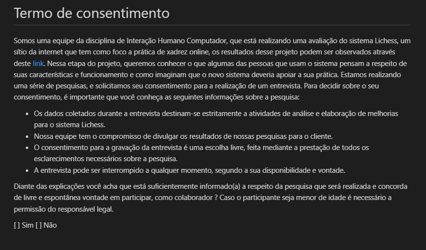

# Planejamento da Avaliação do Storyboard

## Introdução

O presente artefato apresenta o planejamento da avaliação dos storyboards elaborados para a aplicação web lichess. O planejamento baseia-se nas atividades propostas pelo _framework_ DECIDE, a saber:

- D: Determinar os objetivos da avaliação;
- E:  Explorar perguntas a serem respondidas com a avaliação
- C:  Escolher os métodos de avaliação a serem utilizados
- I:  Identificar e administrar as questões práticas da avaliação
- D:  Decidir como lidar com as questões éticas
- E:  Avaliar, interpretar e apresentar os dados

## Objetivos

A avaliação dos storyboards elaborados tem como principais objetivos:

- Avaliar se as tarefas representadas estão de acordo com o contexto do usuário;
- Avaliar se as necessidades do usuário em relação às tarefas representadas são satisfeitas;
- Verificar a necessidade de alterações nos storyboards.

## Metodologia

A avaliação do storyboard será feita por meio de uma entrevista com um usuário da plataforma lichess. Uma vez que a avaliação envolve pessoas, é necessário atentar-se às questões éticas, e a primeira etapa da entrevista consiste na apresentação do termo de consentimento ao entrevistado, com o qual ele pode ou não consentir. Partindo da premissa que o usuário esteja de acordo com os termos, um pequeno período de adaptação ocorrerá, no qual o entrevistador trabalhará para criar um ambiente amigável e descontraído para o entrevistado. A seguir, a proposta do projeto será apresentada e em seguida serão realizadas as perguntas descritas no [roteiro](#roteiro-de-perguntas). Após a finalização do roteiro, o entrevistado terá um período de tempo destinado para fazer comentários e sugestões que não tenham sido abordadas durante a entrevista, caso ache pertinente.

## Questões práticas

As seguintes subseções apresentam o planejamento prático das atividades.

### Recrutamento dos participantes

Por meio do [perfil de usuário](../../analise_requisitos/perfil_usuario.md) foi possível traçar um desenho sobre os grupos que compõem a maior parte de usuários da plataforma, e tendo em vista esse perfil, escolheu-se recrutar um estudante universitário, na faixa etária de 20 a 25 anos e jogador de xadrez competitivo. A busca por usuários foi feita em grupos de xadrez com estudantes da Universidade de Brasília.

### Cronograma da avaliação

| Data e horário | Atividade | Autor(es) | Revisor(es) |
| :-: | - | - | - |
| 16/12/2022   às 10:00 | Execução do teste piloto | Nicolas Souza | Lucas Macedo |
| 18/12/2022   às 09:00 | Entrevista com o usuário | Nicolas Souza   Lucas Macedo | Lucas Gabriel |
| 19/12/2022   até 22:00 | Registro dos resultados da entrevista | Lucas Macedo | Nicolas Souza |

### Papéis dos Avaliadores

Durante a entrevista, dois membros do grupo exercerão o papel de avaliadores. Um deles ficará responsável por observar os comportamentos, comunicação não verbal e respostas do entrevistado, e o outro responsável por conduzir a entrevista.

### Ferramentas

A entrevista será realizada na plataforma Microsoft Teams, para que seja possível gravar o encontro. Os avaliadores e entrevistado podem também utilizar papel e caneta para fazer registros durante a entrevista.

### Teste Piloto

Antes da execução da entrevista, será realizado um teste piloto. O teste piloto consistirá na execução da entrevista com outro integrante do grupo, para avaliar o tempo gasto durante a entrevista, se as perguntas estão adequadas e se será necessário alterar algo no planejamento.

## Questões Éticas

No caso de avaliações que envolvem participantes, é necessário colher o consentimento dos participantes, a partir do termo de consentimento livre e esclarecido, de acordo com os [aspectos éticos](../../analise_requisitos/aspectos_eticos.md) definidos para o projeto.

### Termo de Consentimento livre e esclarecido

Antes de iniciar a avaliação, o avaliador deve apresentar o termo de consentimento ao entrevistado e verificar se ele consente em participar da pesquisa e com a gravação da entrevista.

Figura 1: Termo de Consentimento. (Fonte: autor, 2022)

## Avaliação, interpretação e apresentação dos dados

A avaliação, interpretação e apresentação dos dados será feita por meio do relato de resultados, de acordo com o [planejamento](planejamento_relato.md) realizado.

### Roteiro de Perguntas

A seguir estão registradas as perguntas que comporão a entrevista com o usuário. Caso ele responda **não** ou **não sei afirmar** para qualquer uma delas, o entrevistador deve perguntar em seguida se ele pode justificar o motivo da resposta e se ele possui alguma sugestão de melhoria.

A sequência de perguntas a seguir deve ser executada para cada um dos [storyboards desenvolvidos](#storyboards-desenvolvidos).

#### Perguntas

<ol>
<li> Os atores envolvidos no storyboard são condizentes com a realidade?
    <ul>
    <li> Sim
    <li> Não
    <li> Não sei afirmar
    </ul>
</li>
<li> O ambiente em que ocorre o storyboard é condizente com a realidade?
    <ul>
    <li> Sim
    <li> Não
    <li> Não sei afirmar
    </ul>
</li>
<li> As tarefas realizadas pelos atores no storyboard são condizentes com a realidade?
    <ul>
    <li> Sim
    <li> Não
    <li> Não sei afirmar
    </ul>
</li>
<li> A sequência de ações do storyboard é condizente com a realidade?
    <ul>
    <li> Sim
    <li> Não
    <li> Não sei afirmar
    </ul>
</li>
<li> A motivação do usuário para utilizar a aplicação lichess fica clara no storyboard?
    <ul>
    <li> Sim
    <li> Não
    <li> Não sei afirmar
    </ul>
</li>
<li> Você considera que o ator principal completou seu objetivo na história contada pelo storyboard?
    <ul>
    <li> Sim
    <li> Não
    <li> Não sei afirmar
    </ul>
</li>
</ol>

## Storyboards desenvolvidos

O storyboard é um tipo de protótipo de baixa fidelidade,que consiste em uma série de desenhos mostrando como um usuário pode progredir em uma tarefa utilizando o sistema que está sendo desenvolvido. Pode ser uma série de telas esboçadas no caso de um sistema baseado em GUI. Esse modelo de artefato deve conter os seguintes elementos:

- As pessoas envolvidas;
- Ambiente/contexto;
- Tarefas;
- Passos envolvidos;
- A motivação para usar a sistema;
- O que as pessoas precisam fazer para completar a tarefa;
- A satisfação da pessoa ao completar a tarefa, no final do storyboard.

Os protótipos foram elaborados com base nas tarefas principais executadas pelo usuário durante a utilização do sistema, detalhadas na [análise de tarefas](../../analise_requisitos/analise_tarefas.md).

- Tarefa 1: Jogar uma partida de xadrez

- Tarefa 2: Aprender a jogar xadrez

## Bibliografia

[1] BARBOSA, Simone; DINIZ, Bruno. Interação Humano-Computador. Editora Elsevier, Rio de Janeiro, 2010.

[2] Planejamento da Avaliação do Storyboard - [Projeto Neoenergia 2022.1](https://interacao-humano-computador.github.io/2022.1-AgenciaVirtualNeoenergia/design%2C_avalia%C3%A7%C3%A3o%2C_desenvolvimento/n%C3%ADvel%201/storyboard/planejamento_storyboard/)

## Histórico de Versão

| Versão | Data  | Descrição                          | Autor(es)     |  Revisor(es)  |
| ------ | ----- | ---------------------------------- | ------------- | ------------- |
| `1.0`  | 13/12/2022  | Criação da versão inicial do artefato.|  Nicolas | Lucas Gabriel |
