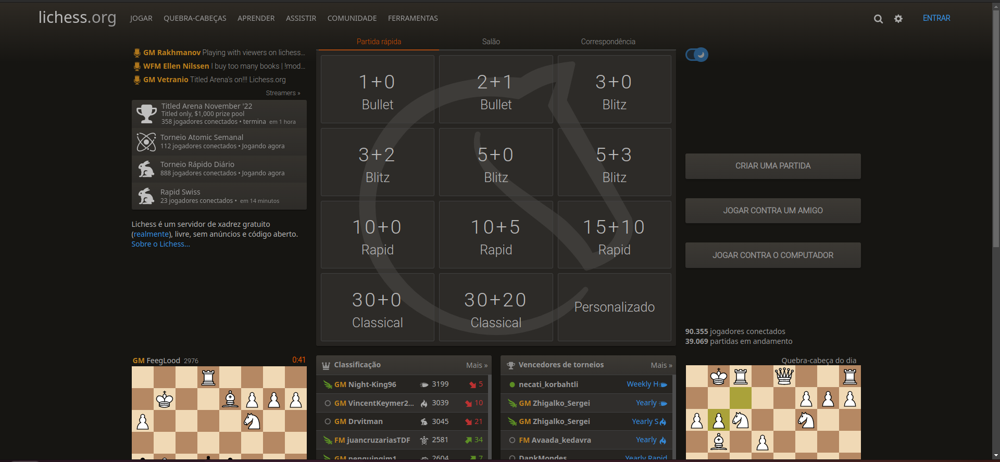

# Sítio eletrônico selecionado para o projeto da disciplina

## Sítios eletrônico analisados

Durante a primeira etapa do projeto, os estudantes realizaram escolhas de sítios da internet, priorizando os do governo ou comunidades de software livre, de forma individual a fim de trazerem propostas para o projeto a ser trabalhado pelo grupo durante a disciplina de Interação Humano Computador, dessa forma cada um fez uma breve avaliação e produziu o artefato de avaliação inicial relativo a sua escolha, com base nessas decisões foram debatidas ideias a respeito de qual desses sítios melhor se encaixaria para ser trabalhado durante a disciplina. Nesse [link](./sites_avaliados.md), é possível observar a escolha de cada integrante do grupo e a avaliação realizada.

## Sítio eletrônico definido pela equipe

Depois da seleção individual, as propostas foram discutidas pela equipe baseando-se nos seguintes critérios:

- Sítio eletrônico ainda não trabalhado na disciplina de Interação Humano Computador.
- Sítio eletrônico com problemas de usabilidade.
- Sítio eletrônico pertencente ao governo ou a uma comunidade de software livre.
- Facilidade de acesso aos usuários do sítio eletrônico.

## Lichess

Dentre os sítios analisados de forma individual, o escolhido foi o "[__Lichess__](https://lichess.org/)". Esse é um sítio gratuito, disponível para uso, de forma online na internet, o qual teve seu projeto inicial realizado como um hobby que com a ajuda da iniciativa de software livre se tornou uma das maiores referências em xadrez online no mundo, mesmo sem fins lucrativos. Essa escolha foi realizada, pois esse foi o que melhor se adequou aos critérios apresentados anteriormente, principalmente com relação à facilidade de contato com os usuários devido aos grupos de xadrez existentes na Universidade de Brasília, além disso, foi constatado que o sítio feria as Heurísticas de Nielsen com relação aos seguintes aspectos:

- Status do sistema
- Controle do usuário e liberdade
- Flexibilidade e eficiência de uso
- Estética e design minimalista
- Ajuda e documentação

Segue, na imagem 1, a página inicial do sítio eletrônico:

Imagem 1 - Imagem da página inicial do sítio eletrônico Lichess

## Bibliografia

[1] BARBOSA, Simone; DINIZ, Bruno. Interação Humano-Computador. Editora Elsevier, Rio de Janeiro, 2010.

## Histórico de Versão

| Versão   | Data       | Descrição            |  Autor(es)       | Revisor(es)          |
| :------: | :--------: |:-------------------: | :-----------: | :-----:          |
| `1.0`    | 19/11/2022 | Criação do documento | Lucas Gabriel  | Nicolas Souza |
