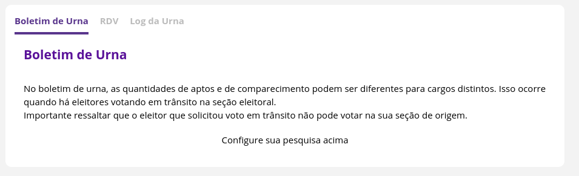
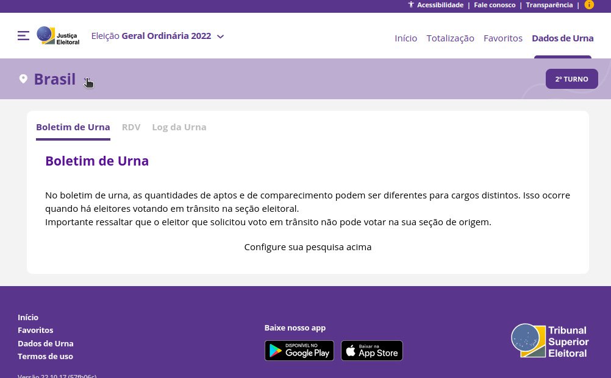

# Avaliação Heurística - Resultados TSE

## Introdução

O site [Resultados - TSE](https://resultados.tse.jus.br/oficial/app/index.html#/eleicao/resultados) tem como objetivo apresentar os resultados, estatísticas e dados das urnas referentes às eleições. O site destina-se a todos interessados nos resultados da eleição, um perfil de usuários com 16 anos ou mais, eleitores e com maior familiaridade com tecnologia, haja vista que os resultados também podem ser acompanhados pelo noticiário.

## Avaliação Heurística

A metodologia de avaliação escolhida foi a **avaliação heurística**, que consiste em uma inspeção sistemática da interface, em busca de problemas de usabilidade. A inspeção baseia-se em diretrizes de usabilidade, chamadas heurísticas. Na seção seguinte estão descritas as heurísticas que foram avaliadas.

## Metodologia

Ao longo da avaliação foram levadas em consideração as seguintes heurísticas, identificadas por códigos para facilitar a citação.

| Código | Descrição |
| :-: | - |
| H1 | Visibilidade do estado do sistema |
| H2 | Correspondência entre o sistema e o mundo real |
| H3 | Controle e liberdade do usuário |
| H4 | Consistência e padronização |
| H5 | Reconhecimento em vez de memorização |
| H6 | Flexibilidade e eficiência de uso |
| H7 | Projeto estético e minimalista |
| H8 | Prevenção de erros |
| H9 | Ajuda ao usuário para reconhecer, diagnosticar e recuperar-se de erros |
| H10 | Ajuda e documentação |

 Tabela 1 - Heurísticas avaliadas 

A avaliação foi realizada pelo avaliador Nicolas Chagas Souza.

## Dados Coletados

A avaliação revelou três problemas de usabilidade, que estão descritos a seguir.

### Problema 1

Abaixo estão registradas as figuras que ilustram o primeiro problema identificado, que é uma violação da heurística H2 - correspondência entre o sistema e o mundo real. As nomenclaturas **totalização**, **RDV** e **log** utilizadas nos menus estão distantes da realidade do público alvo.

 Figura 1 - Menu de navegação 

 Figura 2 - Página de Dados da Urna 

| **Correspondência entre o sistema e o mundo real** |
| - |
| **Verificação:**    O vocabulário e ícones utilizados no sistema está de acordo com o repertório cultural do público alvo? |
|  **Grau de severidade:**    ( ) 0 - Sem importância   ( ) 1 - Cosmético   (X) 2 - Pequeno   ( ) 3 - Grande   ( ) 4 - Catastrófico |
| **Descrição do problema**:
| **Local:** Menu de navegação superior e página de dados da urna, que pode ser acessada pelo menu de navegação.
| **Causa:** As nomenclaturas utilizadas (**totalização, RDV** e **log**) não estão de acordo com o repertório cultural do usuário.
| **Efeito sobre o usuário:** Breve confusão.
| **Efeito sobre a tarefa:** Nenhum.
| **Correções possíveis:**   - Adicionar um texto de explicação sobre o menu que apareça quando o usuário posicionar o cursor sobre a tela.    - Inclusão de um subtítulo no menu indicando o significado dessas palavras.    - Alteração de **log** por **relatório**.|

 Tabela 2 - Relato de resultados - Problema 1 

### Problema 2

Abaixo está ilustrado o segundo problema identificado, a configuração da pesquisa não é intuitiva para o usuário.

 Figura 3 - Ausência de indicativo de onde fazer a configuração da pesquisa 

O caminho para configurar a pesquisa está ilustrado abaixo.

 Figura 4 - Primeiro passo: definir a localização 

 Figura 5 - Segundo passo: selecionar a cidade 

 Figura 5 - Terceiro passo: selecionar a zona e a seção 

| **Reconhecimento em vez de memorização** |
| - |
| **Verificação:**    O usuário precisa se lembrar de uma informação para utilizar o sistema? |
|  **Grau de severidade:**    ( ) 0 - Sem importância   ( ) 1 - Cosmético   (X) 2 - Pequeno   ( ) 3 - Grande   ( ) 4 - Catastrófico |
| **Descrição do problema**:
| **Local:** Página Dados de Urna, que pode ser acessada por meio do menu superior de navegação.
| **Causa:** As nomenclaturas utilizadas (**totalização, RDV** e **log**) não estão de acordo com o repertório cultural do usuário.
| **Efeito sobre o usuário:** Frustração.
| **Efeito sobre a tarefa:** Atraso na execução da tarefa.
| **Correções possíveis:**   - Incluir um link no texto "configure sua pesquisa acima", que abra a janela de seleção da região.   - Incluir um ícone de ajuda, que direcione para uma página com instruções de uso.   |

 Tabela 3 - Relato de resultados - Problema 2 

### Problema 3

| **Ajuda e Documentação** |
| - |
| **Verificação:**    Existem páginas de ajuda ou tutoriais para auxiliar o usuário? |
|  **Grau de severidade:**    ( ) 0 - Sem importância   ( ) 1 - Cosmético   (X) 2 - Pequeno   ( ) 3 - Grande   ( ) 4 - Catastrófico |
| **Descrição do problema**:
| **Local:** Não se aplica.
| **Causa:** Não há uma página de ajuda com perguntas frequentes e tutoriais de uso da ferramenta.
| **Efeito sobre o usuário:** Frustração.
| **Efeito sobre a tarefa:** Nenhum.
| **Correções possíveis:**   - Incluir uma página de ajuda.   - Incluir tutoriais de uso nas páginas do sistema.|

 Tabela 4 - Relato de resultados - Problema 3 

## Referências Bibliográficas

- MACIEL, C. _et al_. Avaliação Heurística de Sítios na Web. Niterói, RJ: UFF, 2004.

- Barbosa, S. D. J.; Silva, B. S. da; Silveira, M. S.; Gasparini, I.; Darin, T.; Barbosa, G. D. J. (2021) Interação Humano-Computador e Experiência do usuário. Autopublicação. ISBN: 978-65-00-19677-1.

## Histórico de Versão

| Versão | Data  | Autor         | Descrição            | Revisor       |
| ------ | ----- | ------------- | -------------------- | ------------- |
| 1.0    | 16/11 | Nicolas Souza | Criação do Documento | Mauricio |