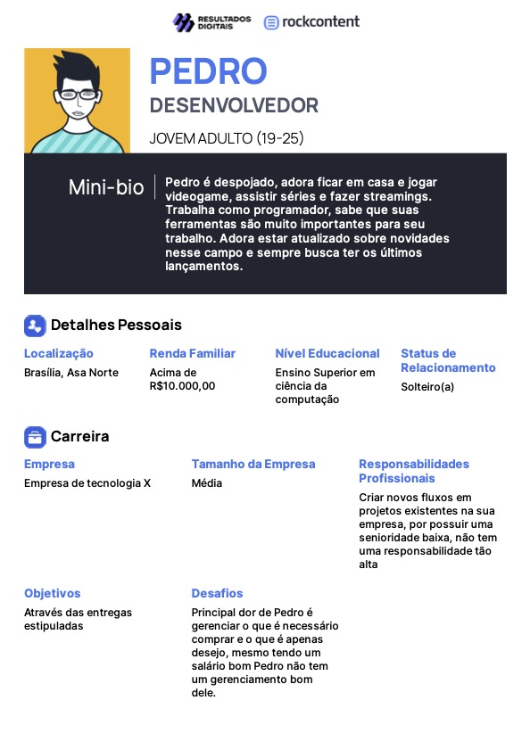

# Avaliação - Resultados Age Telecom

## Introdução

O site [Age telecom](https://www.agetelecom.com.br) tem como objetivo dispor informações e servir como ponte para contratação de serviços de internet. O site tem como perfil de usuários ativos, adultos com renda maiores de 18 anos.
Para avaliação do site fora utilizado o framework DECIDE. Nele apontamos duas metodologias de avaliação para execução: avaliação heurística e percurso cognitivo.

## Avaliação Heurística

Abaixo temos uma lista de violações encontradas junto de seu grau de severidade e uma sugestão de possível solução:

- Reconhecimento através de memorização: Sistema apresenta modos de navegação conhecidos (carrossel, barra de menu, mensagens interativas) porém com comportamentos diferentes dos padrões implementados.
  - Severidade: **Baixa**
  - Solução: Manter comportamentos originais dos sistemas de navegação, carrossel deve navegar um item a cada clique, barras de menu devem ser objetivas e sem muita iteração dentro delas, mensagens interativas devem ter um campo indicando sua limitação para entender onde acabam.

---

- Projeto estético e minimalista: Interface contém informações desnecessárias e poluentes. Um exemplo disso, é um bottom dropdown (ao clicar nele diversas opções aparecem) que ocupam toda a tela vertical e parecem ter um overflow indo além do espaço vertical limitado.
  - Severidade: **Média**
  - Solução: Remover o botão de cobertura da barra de menu e adicionar ela na aba de seleção de planos, visto que é uma informação associada para o plano.

---

- Consistência e padronização: Acessos de abas de navegação possuem comportamentos diferentes. Ao acessar abas via a barra de menu. Certas abas indicam que o usuário está nela, através da mudança da cor textual da opção na barra de menu enquanto outras abas não reproduzem esse comportamento.
  - Severidade: **Baixa**
  - Solução: Todas as abas devem indicar quando estão ativas.

---

- Prevenção de erros: Erro ao carregar lista de perguntas frequentes apresenta ao usuário
  final apenas uma lista vazia sem demonstrar para o usuário que de fato ocorreu um erro.
  - Severidade: **Média**
  - Solução: Adicionar mensagem de erro para seguintes casos:
    - Não foi possível carregar a lista;
    - Lista carregada mas e vazia.

---

- Consistência e padronização: Ao acessar os planos disponíveis para uso, usuário pode escolher entre com fidelização e sem fidelização. Acontece que não existem planos sem fidelização disponíveis, assim esse design gera inconsistência.
  - Severidade **Média**
  - Solução: Remover o toggle que altera entre planos com e sem fidelização.

---

- Ajuda e documentação: Site apresenta pouquíssimas informações ao apresentar os
  possíveis planos de internet selecionáveis, representam chamadas de ação como: franquia ilimitada e instalação grátis. Para ter acesso total a essas informações deve-se realizar contato via whatsapp, uma barreira adicional que pode desanimar o consumidor de fazer a compra, além de dificultar possíveis resoluções de problemas.
  - Severidade: **Alta**
  - Solução: Ao clicar no plano selecionado levar um usuário a uma página do plano específico, com informações mais específicas e acesso a documentos que regem contratações do serviço.

---

- Flexibilidade e eficiência de uso: Não possui suporte para navegação acessível sem o mouse.
  - Severidade: **Baixa**
  - Solução: Alterar estrutura do código, a fim de usar tags html compatíveis com a necessidade comentada.

---

- Flexibilidade e eficiência de uso: Possui botões de seleção de plano grandes que ao ficar sobre eles mudam de cor indicando possibilidade de clique, porém ao clicar não funciona, exceto se clicar em área específica do botão
  - Severidade: **Média**
  - Solução: Tornar o botão inteiro clicável.

---

- Ajuda e documentação: Informações sobre prazo de fidelidade e multa estão escondidas
  e em fonte muito pequena, fazendo usuário não saber ao certo sobre essas informações.
  - Severidade: **Alta**
  - Solução: Replicar essa informação de forma constate no site e além disso, na página de planos deixar essa informação abaixo das possíveis opções.

---

- Controle e liberdade de uso: Ao acessar página de blog não existem mecanismos para facilitar a busca de um blog específico, o usuário deve navegar por todos os blogs até encontrar o que encontra.
  - Severidade: **Baixa**
  - Solução: Adicionar uma barra de pesquisa na página de blogs.

---

- Correspondência entre sistema e o mundo real: Utilização de siglas pouco conhecidas
  no mundo real e fortemente limitadas ao mercado de rede de internet. Além disso, não existem metáforas ou assimilações para usuários que não sabem sobre o serviço.
  - Severidade: **Baixa**
  - Solução: Utilizar o termo completo e se necessário adicionar breves explicações.

---

- Prevenção de erros: Permite o usuário ser levado a domínios expirados e, portanto, não
  seguros para o usuário.
  - Severidade: **Alta**
  - Solução: Análise de links para acessos externos e em caso de expiração sua
    remoção do site.

---

- Consistência e padronização: Possui acesso para o portal de clientes escondidos e sem
  nenhuma indicação de ser interativo. Pode gerar uma barreira ao acessar os pagamentos.
  - Severidade: **Média**
  - Solução: Documentação sobre essa página de portal além disso, reforçar interação do botão via contraste de cor.

---

## Percurso cognitivo

Para realização do percurso cognitivo foram elaborados duas personas (Figuras 1 e 2).

### Pedro

 Figura 1: Persona Pedro (Fonte: [3]).

#### Percurso de Pedro: Assinar um plano de internet

- Durante a semana, o serviço contratado por Pedro apresentou diversas instabilidades e
  um suporte fraco o fez querer mudar de rede. Para isso Pedro pesquisou as principais redes de Brasília, filtrou pela nota de recomendação e em seguida decidiu pelos benefícios e preço. Ao final disso decidiu que iria contratar o serviço Age Telecom.
- Dificuldades encontradas
  - Descobrir sobre termos como fidelização e multa de forma independente sem ajuda do suporte técnico. - Tentar mandar um formulário de suporte via site. Formulário apresenta o botão
    escondido e sem sua ativação, servindo o formulário de template bonito.
  - Realizar a contratação do plano de forma independente e realizar o
    agendamento via site (essas atividades são feitas pelo Whatsapp).

---

### Eugênia

 Figura 2: Persona Eugênia (Fonte: [3]).

#### Percurso de Eugênia: Assinar um plano de internet

- Durante conversa com amiga, Eugênia aponta como sua internet está ruim e como deseja trocar por uma melhor, mas não sabe qual colocar. Paula sua amiga, sugere que ela assine o plano da Age Telecom e passa a falar como essa rede tem sido boa para ela. Após a ligação Eugênia busca por esse site para assinar um novo plano de internet.
- Dificuldades encontradas
  - Qual velocidade devo escolher?
  - Onde devo clicar para conseguir realizar a compra?
  - Tenho certeza que minha região pega essa rede?

## Bibliografia

[1] MACIEL, C. _et al_. Avaliação Heurística de Sítios na Web. Niterói, RJ: UFF, 2004.

[2] Barbosa, S. D. J.; Silva, B. S. da; Silveira, M. S.; Gasparini, I.; Darin, T.; Barbosa, G. D. J. (2021) Interação Humano-Computador e Experiência do usuário. Autopublicação. ISBN: 978-65-00-19677-1.

[3] Ferramenta para geração de personas, disponível no [link](https://www.geradordepersonas.com.br/). Acesso em 07/12/2022.

## Histórico de Versão

| Versão | Data       | Descrição            | Autor(es)           | Revisor(es)        |
| ------ | ---------- | -------------------- | ---------------- | -------------- |
| `1.0`  | 16/11/2022 | Criação do Documento | Mauricio Machado | Nicolas Souza  |
| `1.1`  | 07/12/2022 | Atualização das legendas e bibliografia | Nicolas Souza |     |
