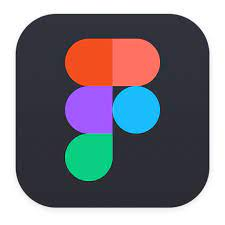
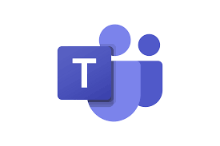

# Ferramentas

## 2. Introdução

 As ferramentas foram escolhidas visando a fácil interação dos integrantes do grupo em contexto remoto, tanto assíncrono quanto síncrono. Também foi levado em consideração o nível de familiaridade dos integrantes com as ferramentas, com a intenção de diminuir o atrito e aumentar a eficiência nas atividades do projeto. 

## 3. Ferramentas utilizadas

Tabela 1: Ferramentas utilizadas no projeto

|                    Logo                    |     Ferramenta     | Finalidade                                                                                                                                                                |
| :----------------------------------------: | :----------------: | ------------------------------------------------------------------------------------------------------------------------------------------------------------------------- |
|           |       Github       | Utilizado como repositório dos documentos produzidos e para o versionamento dos mesmos.                                                                                   |
|            |       Figma        | Utilizado para elaborar os protótipos de média e alta fidelidade                                                                                                          |
|       |      Telegram      | Foi o software escolhido como o sistema de mensagens possibilitando uma comunicação mais ágil e constante do grupo.                                                       |
|  |  Google Planilhas  | Utilizado para construir o cronograma das atividades                                                                                                                      |
|             |  Microsoft teams   | Nas apresentações dos pontos de controle foi utilizado para compartilhar a tela com a github pages, gravar a apresentação o projeto e elaboração dos artefatos do projeto |
|         |      Youtube       | Utilizado para armazenar os links das gravações do projeto.                                                                                                               |
|           | Visual Studio Code | Utilizado para manipulação dos arquivos do projeto, devido facilidade de integração de extensões e da experiência da maioria dos integrantes com essa ferramenta.         |

Fonte: Grupo 2

## 4. Referências

> Wiki Requisitos - Planejamento - Ferramentas. Disponível no [link](https://requisitos-de-software.github.io/2022.1-TikTok/ferramentas/). Acesso em: 16 de novembro de 2022.

# Histórico de Versão

| Versão   | Data       | Descrição                         |  Autor        | Revisor          |
| :------: | :--------: |:--------------------------------: | :-----------: | :-----:          |
| `0.1`    | 16/11/2022 | Adição das ferramentas do projeto | Lucas Macedo   | Nicolas Souza |
